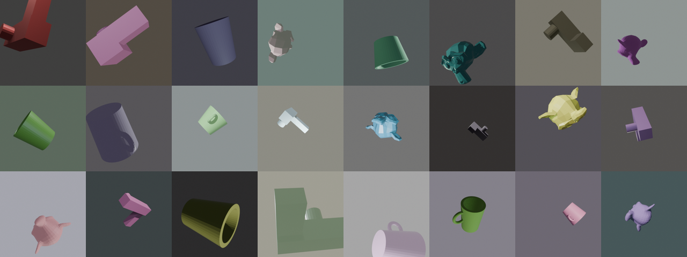
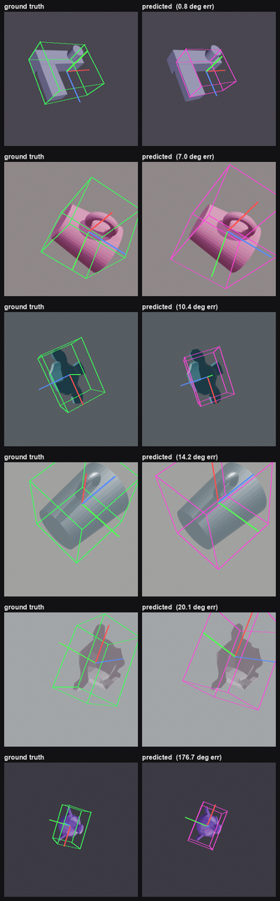
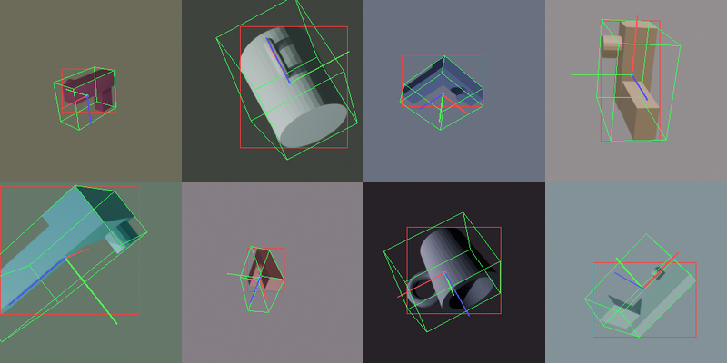

# Synthetic-to-Real 3D Pose Estimation

An end-to-end pipeline that procedurally generates a labelled synthetic 3D dataset in
Blender, trains a PyTorch model to recover an object's 6-DoF pose from a single RGB
image, and evaluates it quantitatively and visually.

**Status: Phases 1-3 complete.** 20,000 rendered images with exact pose labels (all
geometrically verified), a trained model at **15.9 deg mean rotation error** on a held-out
test set against a ~126 deg chance baseline, and per-category evaluation with rendered
prediction comparisons.



---

## Results

Held-out test set, 2,000 images never seen during training or model selection.

| metric | baseline (5k) | final (20k) |
|---|---|---|
| mean rotation error | 71.98 deg | **15.87 deg** |
| median rotation error | 49.92 deg | **12.00 deg** |
| 90th percentile | 165.21 deg | **26.92 deg** |
| within 10 deg | 4.8% | **38.0%** |
| within 30 deg | 31.6% | **93.0%** |
| translation rel. error | 0.148 | 0.136 |
| train/val loss gap | 163x | **1.7x** |

Chance is ~126 deg -- the mean angle between two uniformly random rotations.

Per category, the final model is uniform, which is the point of the dataset work below:

| category | mean | median | within 10 deg | 180 deg flips |
|---|---|---|---|---|
| suzanne | 16.51 deg | 12.16 deg | 35.8% | 1.1% |
| mug | 14.95 deg | 11.62 deg | 39.9% | 0.2% |
| bracket | 16.14 deg | 12.02 deg | 38.5% | 0.4% |

Green is ground truth, magenta is the prediction:



---

## Quick start

```bash
python3 -m venv .venv
.venv/bin/pip install -r requirements.txt

.venv/bin/python tools/check_ambiguity.py                 # shapes must be pose-distinguishable
.venv/bin/python blender_gen/generate.py --out data/synthetic --n 20000
.venv/bin/python tools/verify_dataset.py --data data/synthetic --check-all
.venv/bin/python model/train.py --run improved --epochs 25 --dropout 0.1
.venv/bin/python model/evaluate.py --checkpoint checkpoints/improved/best.pt --split test
```

Generation is headless and fully decoupled from training. It runs through the `bpy` pip
module as above, or through a GUI Blender install:

```bash
blender --background --python blender_gen/generate.py -- --out data/synthetic --n 20000
```

---

## Phase 1 - Synthetic data generation

### Why generate instead of photograph

Training needs thousands of images with correct 6-DoF labels, and **a human cannot
produce those labels**. Nobody can look at a photo and report an object's rotation to
useful precision; real datasets of this kind need motion-capture rigs. Building the scene
in 3D inverts the problem -- the pose is an *input*, so the label is exact and free.

### Output

```
data/synthetic/
  images/{train,val,test}/rgb_000000.png     256x256 RGB
  depth/{train,val,test}/depth_000000.npz    float16 metric depth, 0 = background
  labels/{train,val,test}/meta_000000.json   intrinsics, 6-DoF pose, material, seed
  dataset.json                               config, split sizes, per-class counts
```

| | |
|---|---|
| Samples | 20,000 (16,000 train / 2,000 val / 2,000 test) |
| Categories | bracket 6,732 / mug 6,638 / suzanne 6,630 |
| Camera distance | 2.80 - 5.00 m | 
| Camera elevation | -25 to +75 deg |
| Focal length | 40 - 80 mm |
| Object coverage | 1.7% - 55.9% of frame (mean 13.2%) |
| Throughput | ~4.2 img/s on an Apple M3 (~80 min) |
| Rejected poses / missing files | 0 / 0 |

Each sample's randomisation is seeded by its **index alone**, independent of dataset
size, so `--n 20000` reproduces the first 5,000 samples of `--n 5000` bit-for-bit and
`--start` resumes an interrupted run correctly.

### Design decisions

**Labels use the OpenCV convention.** Blender is Z-up with the camera looking down its
local `-Z`; vision code assumes Y-down, `+Z` forward. Converting once at generation time
means the training code never mixes the two.

**Rotation is stored redundantly** as a matrix, a sign-canonicalised quaternion, and the
6D representation, so downstream code picks its parameterisation without re-deriving it.

**Viewpoints are area-uniform on the sphere** -- elevation is sampled uniformly in
`sin(elevation)`, since sampling the angle would over-represent the poles.

**Poses are rejection-sampled, not clamped.** Clamping puts spikes at the distribution
boundaries. Rejection rate at current settings is 0%.

---

## Phase 2 - Model

`PoseNet`: ImageNet-pretrained ResNet-18 backbone (11.4 M parameters) with separate
rotation and translation heads.

**Rotation uses the continuous 6D representation** (Zhou et al., CVPR 2019), projected
onto SO(3) by Gram-Schmidt. Quaternions and Euler angles are discontinuous as maps onto
SO(3): near the seam an arbitrarily small change in rotation demands a large change in
network output, which caps achievable accuracy. The 6D form has no seam, and the
projection makes an invalid rotation impossible to emit.

**The model predicts `t/s`, not `t`.** Object scale and camera distance were randomised
independently, so a small near object and a large far one render to *identical* images:

```
scale 0.80 at 2.80 m  ->  apparent size 0.286
scale 1.40 at 4.90 m  ->  apparent size 0.286
```

Metric translation is therefore unrecoverable from a single image -- not by this model,
not by a perfect one. `t/s` is fully determined; multiply by the true object size to
recover `t`. Training on `t` would optimise toward a target the input does not determine,
and the irreducible error would masquerade as model failure.

**The loss and the metric differ on purpose.** The reported metric is geodesic angle;
the optimised loss is the squared Frobenius (chordal) distance. Differentiating the
geodesic angle means differentiating `acos`, whose gradient is unbounded at 0 and pi --
most unstable exactly when the prediction is nearly correct. Frobenius is smooth
everywhere and shares its minimum.

**Augmentation is photometric and occlusion only.** Flips, rotations, crops and
translations all change the object's true pose while leaving the label untouched, so they
would teach the model wrong answers with full confidence. A horizontal flip is the worst
case: it maps a rotation to a mirror image, which is not a rotation at all.

---

## The central finding: two hidden pose ambiguities

Phase 1 excluded cubes and spheres because a rotationally symmetric object makes pose
regression ill-posed -- for a cube, 24 distinct rotations produce the same image, so the
loss-minimising prediction is their average, which is wrong for all 24. That reasoning was
right. **The execution was not.** Two of the three replacement shapes carried symmetries
I had not checked for, and the first trained model exposed both.

### How it showed up

Per-category error on the 5k baseline was wildly uneven -- and the error *distribution*,
not its mean, identified the cause:

| category | mean error | 0-30 deg | 150-180 deg |
|---|---|---|---|
| suzanne | 39.3 deg | 53.8% | 3.1% |
| bracket | 85.2 deg | 16.4% | 19.5% |
| mug | 101.3 deg | 18.5% | **36.3%** |

Suzanne's errors are unimodal and concentrated near zero. The mug and bracket are
**bimodal**, with a large spike at 150-180 deg. Random error does not do that. A spike at
~180 deg means the model is confidently predicting a pose that is exactly backwards --
the signature of two orientations that produce the same image.

### The causes

**The mug was exactly symmetric.** It was a closed, vertically centred cylinder with its
handle at mid-height -- invariant under a 180 deg rotation about the handle axis. Turn it
upside down and it is unchanged. Rendering a pose and its flip gave a difference of
*exactly* 0.000000: pixel-identical. A real mug escapes this only because it has an open
top and a closed bottom, which mine did not.

**The bracket was near-symmetric.** The L was thin enough to be effectively planar and
mirror-symmetric about its own mid-plane. A flat object with two identical faces looks the
same flipped front-to-back, because the projection cannot say which face you are seeing.
Being *near*-symmetric rather than exactly symmetric made it harder to spot, not easier
to learn.

### The fix, and the tool that verifies it

`tools/check_ambiguity.py` measures the property directly: render each shape at a pose and
at that pose composed with a 180 deg flip about each object axis, under identical camera
and lighting, then score how distinguishable the renders are. Differences are measured
**inside the object silhouette** (from the alpha channel) -- an early version averaged
over the whole image and called every shape ambiguous, because the object covers ~13% of
the frame and identical background swamped the signal.

The shapes were rebuilt: the **mug** gained a tapered body, a hollowed open top over a
solid base, and a handle offset above mid-height (three independent symmetry breaks, so no
single one has to carry it); the **bracket** gained thicker arms, unequal cross-sections,
and a raised boss on one face only -- the boss being the load-bearing fix, since with it
no rotation maps the shape to itself.

| shape | worst-case distinguishability | confusable |
|---|---|---|
| suzanne | 1.07 | 0% |
| mug | 0.40 (was **0.00**) | 0% |
| bracket | 1.30 | 0% |

The tool is validated in both directions: run against a sphere, cylinder and cube --
shapes with known rotational symmetry -- it scores all three at exactly 0.0 and flags
them. A check that cannot fail proves nothing.

### Confirmation

Retraining on the corrected dataset was a falsifiable test, and it passed:

| category | flip rate before | flip rate after | mean error before | after |
|---|---|---|---|---|
| mug | 36.3% | **0.2%** | 101.3 deg | **15.0 deg** |
| bracket | 19.5% | **0.4%** | 85.2 deg | **16.1 deg** |
| suzanne | 3.1% | **1.1%** | 39.3 deg | **16.5 deg** |

The mug went from the worst category to the best. The bimodal tail is gone and all three
distributions are now unimodal and nearly identical -- which is what you expect when the
remaining error is genuine estimation difficulty rather than an unanswerable question.

---

## How the labels are verified

Every label passes through a chain of conventions -- Blender's Z-up world, a camera
looking down `-Z`, the flip into OpenCV's Y-down frame, intrinsics under `AUTO` sensor
fit, and PNG's top-left row order. A sign error anywhere still produces a dataset that
*looks* fine, and surfaces much later as a model that will not converge.

`tools/verify_dataset.py` closes the loop geometrically: project the object's 3D bounding
box with the stored pose, derive the true silhouette **independently** from the depth map,
and check the projection lands on the object. The metric is *containment* -- the fraction
of real object pixels inside the projected box -- which must be 1.0, because a bounding
box contains what it bounds.

| split | n | containment (mean / min) | corners in front | depth consistent |
|---|---|---|---|---|
| train | 16,000 | 1.0000 / 1.0000 | yes | yes |
| val | 2,000 | 1.0000 / 1.0000 | yes | yes |
| test | 2,000 | 1.0000 / 1.0000 | yes | yes |



**This check earned its keep immediately.** Assigning `cam.matrix_world` from a nested
Python list silently does nothing -- `matrix_world` is derived, so the next depsgraph
update recomputes it from the untouched loc/rot/scale channels. Nothing raises. The camera
never moved, and the first run rendered from *inside* the object with confidently wrong
labels. An in-script assertion comparing the analytic pose to Blender's own matrix did
**not** catch it, because it never consulted the camera -- it checked my math against my
math. Only comparing labels to rendered pixels found it.

`tests/test_rotation_parity.py` covers the analogous risk on the model side: the label
math is NumPy and the training math is PyTorch, two implementations of the same equations
that nothing but a test keeps in sync.

---

## Notes on Blender 5.2

`bpy==5.2.1` is Blender 5.2 LTS, whose API differs from the 4.x most tutorials target:

| | Blender 4.x | Blender 5.2 |
|---|---|---|
| EEVEE engine id | `BLENDER_EEVEE_NEXT` | `BLENDER_EEVEE` |
| Compositor | `Scene.node_tree` | `Scene.compositing_node_group` |
| File Output node | `base_path`, `file_slots` | `directory`, `file_name`, `file_output_items` |
| File Output format | any image format | locked to multilayer OpenEXR |

The last row is why depth arrives as an `.exr` with a `depth.V` channel and needs the
`OpenEXR` package; `generate.py` converts it to compressed float16 `.npz` and deletes the
EXR, so nothing downstream needs an EXR reader.

---

## The sim-to-real gap, measured

The project claims synthetic-to-*real* transfer, so the size of that gap is a result the
reader is owed. Photographs are the real test and need a camera; what can be measured
without one is how the model degrades under corruptions that separate a render from a
photograph. `tools/domain_shift_eval.py` applies each to the held-out test split at
increasing severity -- including compositing objects onto procedural clutter using their
depth masks, which is the closest available stand-in for "photographed on a real desk".

| corruption | clean | mild | severe | worst-case change |
|---|---|---|---|---|
| **background clutter** | 16.1 deg | 73.5 deg | **99.9 deg** | **+83.9 deg** |
| jpeg artefacts | 16.1 deg | 18.8 deg | 87.1 deg | +71.0 deg |
| defocus blur | 16.1 deg | 17.6 deg | 52.3 deg | +36.2 deg |
| sensor noise | 16.1 deg | 19.1 deg | 29.2 deg | +13.1 deg |
| **white balance** | 16.1 deg | 16.4 deg | **17.0 deg** | **+1.0 deg** |

The pattern is the finding. **The model is nearly immune to what the generator randomised
-- lighting colour and material, +1.0 deg -- and collapses on the one thing it never varied:
background.** Even mild clutter drops accuracy within 30 deg from 93% to 21%; at full
clutter, 99.9 deg mean error is barely distinguishable from the 126 deg chance baseline.
That is domain randomisation working and its absence failing, measured in one experiment,
and it says where the effort belongs: adding backgrounds and HDRI lighting to Phase 1,
not tuning the model.

It also predicts the outcome of the photograph test honestly -- a mug on a desk is exactly
the cluttered-background condition -- so the expectation going in is failure, and the
interesting question is by how much.

### Running the photograph test

`model/predict_real.py` takes a folder of photographs. Absolute pose labels are
unavailable by hand -- the problem that motivated synthetic data in the first place -- so
there are two honest ways to score it:

*Qualitative*: predict a pose per photo and draw the predicted orientation on the image.

*Quantitative, without pose labels*: photograph the object rotating in known increments
(a mug on a plate, turned 30 deg at a time). Absolute pose is still unlabellable, but the
**relative** rotation between consecutive frames is known exactly, and
`--turntable-step 30` scores predicted relative rotations against it.

```bash
.venv/bin/python model/predict_real.py --images real_photos/ --turntable-step 30
```

A rotation is only meaningful against a reference orientation, and the model's reference
is how the object was built in Blender: `+Z` up through the cup axis from base to rim,
`+X` out through the handle. Photographs must use the same convention or the absolute
numbers are unanchored.

**This section reports no real-photograph results because none have been captured yet.**
The harness and the protocol are in place; the numbers are not, and are not claimed.

## Limitations

- **Validation error was still falling at epoch 25.** The final number is a stopping
  point, not a converged one; a longer schedule would improve it.
- **Translation barely improved** (0.148 -> 0.136 relative error) while rotation improved
  4.5x. The loss weighting is likely dominated by the rotation term, and translation
  deserves separate tuning.
- **No background clutter or ground plane.** Objects float against randomised solid
  colour. This is the largest remaining sim-to-real gap and the first thing to address
  before testing on real photographs.
- **No textures.** Untextured Principled BSDF only; Substance 3D texturing is a stretch
  goal in the requirements.
- **Full-frame input, no detect-and-crop.** Objects average 13.2% of the frame, so the
  model spends capacity on localisation as well as orientation. Standard pose pipelines
  detect and crop first.
- **Three procedural categories**, not scanned real objects.
- **No sim-to-real evaluation yet.** The "synthetic-to-real" claim is untested against
  real photographs. The domain-shift measurement above predicts it will fail on cluttered
  backgrounds, but predicting a failure is not the same as measuring one.

---

## Repository layout

```
blender_gen/   geometry.py (pure-numpy pose math), assets.py, scene_builder.py, generate.py
model/         rotation.py, dataset.py, model.py, train.py, evaluate.py
model/         ... predict_real.py (sim-to-real inference on photographs)
tools/         verify_dataset.py, check_ambiguity.py, dataset_stats.py, domain_shift_eval.py
tests/         test_rotation_parity.py
data/          generated dataset (gitignored)
results/       metrics, verification overlays, prediction comparisons
checkpoints/   training runs (gitignored)
```

`blender_gen/geometry.py` imports no `bpy`, so the verification tool and the training code
share the exact pose math the renderer used.
